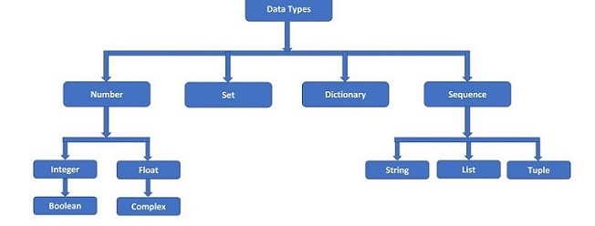

# py (3.10+)
### 0. basic 
- everything is object , Dynamically typed (duck type), **object** (base class)
- **global object** -> has global function defined, etc
- **package** (also object): 
    - directory with `__init__.py`
    - object has : `__path__    - __name__      __package__      __path__      __file__      __doc__`
- we create custom module-1, py file (start with _ or letter)
- with obj1 (start and end context) ⬅️
    - with **open**(file1, "r"):
    - special methods : `__start__ , __end__`
- **global** / **nonlocal** : keyword used inside a function to declare that a variable refers to the global (module-level) variable, allowing you to modify it.
    - [glocal+nonlocal.py](../../src/pyBasicModule/year2025/others/glocal%2Bnonlocal.py)
- **ternary** : a if condition else b

### 1. datatype
- 
- inbuilt class, lower case unlike java, use module for more types.
- **type, class, Enum, module**
- range, int, float, complex(imaginary number), **decimal**.Decimal
- str (string, char), bool
- NoneType is type, None : A singleton object representing “no value” or “null” ⬅️
- Type Checking -> `isinstance(T,obj1)` or` type(obj1) == "T"`
- **collection/s** - simpler inbuild + module:collections
    - **enumerate( list1 )** while looping need , Index + Value Together
    - **array.array or list []** 
      - Mutable, Mixed types allowed
      - array.array -> memory-efficient for large numeric data |  array.array('i', [1, 2, 3])  # 'i' means integer
      - students = [Student("Alice", 22, 88),Student("Bob", 20, 95)]; students[0] = Student("Charlie", 23, 70); mutate
      - students.sort(**key**=lambda s: s.grade, **reverse**=True/False)
      - [list1.py](../../src/pyBasicModule/year2025/list1.py)
      - :point_right: .remove("item1"), pop(), l1 += l2,  sort(), reverse(), copy()
    - **tuple ()**
        - Immutable, hetro
        - fruits = ["apple", "banana", "cherry"]; fruits[0] = "orange"; :x:
    - **dict {}**
        - K:V pair, obj literal in js, alternative for Map, mutable
        - person = {"name": "Alice", "age": 30}
        - person["age"] === person.age
        - :point_right: .pop(k1) or del dict1[k1], dict1[k1] or dict1.get(k1,"defaultv1"), .items(), .keys(), .values(), .copy(), update(dict2) or dict1 |= dict2
        - [dict1.py](../../src/pyBasicModule/year2025/dict1.py)
    - **set, frozenset([])** 
    - **bytes (mutable), bytearray (immutable), memoryview**
      - memoryview - View over bytes/bytearray without copying - better performance.
      - struct module - binary processing
    - **generics with collection** ❓
        - type hinted in 3.9+ 
        - Optional with type hints 
    - **Ellipsis** 
        - print(type(...)) # < class 'ellipsis' > [ellipsis1.py](../../src/pyBasicModule/year2025/datatype/ellipsis1.py)
        - so in short, its just special constant value ... 
        - and it developer creativity to write custom logic around it
        - used in NumPy , fastApi
- formatting: 
    - [formating-1.py](../../src/pyBasicModule/year2025/datatype/formating-1.py) ➕ 
    - always return str, cobert to desired type with glocal funcion.

### 2. Sequence types

| Type         | Mutable | Ordered | Duplicates Allowed | Indexable |
| ------------ | ------- | ------- | ------------------ | --------- |
| `list`       | ✅ Yes   | ✅ Yes   | ✅ Yes              | ✅ Yes     |
| `tuple`      | ❌ No    | ✅ Yes   | ✅ Yes              | ✅ Yes     |
| `range`      | ❌ No    | ✅ Yes   | ✅ Yes              | ✅ Yes     |
| `str`        | ❌ No    | ✅ Yes   | ✅ Yes              | ✅ Yes     |
| `bytes`      | ❌ No    | ✅ Yes   | ✅ Yes              | ✅ Yes     |
| `bytearray`  | ✅ Yes   | ✅ Yes   | ✅ Yes              | ✅ Yes     |
| `memoryview` | ✅ Yes\* | ✅ Yes   | ✅ Yes              | ✅ Yes     |

- **operation on sequence**

| **Operation**      | **Syntax**          | **Description**           | **Example (List)**    | **Example (String)**       |
| ------------------ | ------------------- | ------------------------- | --------------------- | -------------------------- |
| Indexing           | `s[i]`              | Get item at index         | `lst[1] → 20`         | `'abc'[1] → 'b'`           |
| Slicing            | `s[start:end:step]` | Get subsequence           | `lst[1:3] → [20, 30]` | `'hello'[1:4] → 'ell'`     |
| Length             | `len(s)`            | Number of elements        | `len(lst) → 5`        | `len('abc') → 3`           |
| Membership test    | `x in s`            | Check if item exists      | `20 in lst → True`    | `'a' in 'abc' → True`      |
| Concatenation      | `s + t`             | Combine sequences         | `lst + [60]`          | `'abc' + 'def'`            |
| Repetition         | `s * n`             | Repeat sequence           | `lst * 2`             | `'ab' * 3 → 'ababab'`      |
| Iteration          | `for x in s:`       | Iterate through sequence  | `for i in lst:`       | `for ch in 'abc':`         |
| Min/Max            | `min(s)`, `max(s)`  | Smallest/largest item     | `min(lst)`            | `max('zxy')`               |
| Sum (numeric only) | `sum(s)`            | Total of values           | `sum(lst)`            | –                          |
| Index              | `s.index(x)`        | Find first index of value | `lst.index(20)`       | `'abc'.index('b')`         |
| Count              | `s.count(x)`        | Count occurrences         | `lst.count(20)`       | `'banana'.count('a')`      |
| Sorted             | `sorted(s)`         | Returns new sorted list   | `sorted(lst)`         | `sorted('cba')`            |
| Reversed           | `reversed(s)`       | Returns reverse iterator  | `list(reversed(lst))` | `''.join(reversed('abc'))` |

  
### 3. programming constructs
- **logical Operator** : and or not
- **bitwise** : or ` | and & | not ~ | XOR ^ | << | >>
- **Identity and Membership Operators**

  | Operator | Description     | Example      | Result       |
  | -------- | --------------- | ------------ | ------------ |
  | `is`     | Same object     | `a is b`     | `True/False` |
  | `is not` | Not same object | `a is not b` | `True/False` |
  | `in`     | Exists in     | `'a' in 'cat'`     | `True` |
  | `not in` | Not exists in | `'z' not in 'cat'` | `True` |

- if, elif, else
- no native switch:  [custom-switch.py](../../src/pyBasicModule/year2025/others/custom-switch.py) 
- **Ternary** : a if condition else b
- **loops**: 
    - for i in range(3) / [1, 2, 3] / {1, 2, 3} 
    - while x > 0: 
    - break | continue 
    - warp with enumerate(list1)
    - **itertools** Powerful Looping Utilities
      - for i in itertools.`repeat`(5, 3):
      - for i in itertools.`cycle`([1, 2]):
      - ...
    - for key, val in **dict1**.items():
    - List/set comprehension + generator expression
    - for index in range(len(meal)-1, -1, -1): # range with 3 arg, negative steps
  
### 4. modules 
- .py files
- bts, module is object. since everthing is object in py.
- import module : no need to explicitly export like in TS
- python3 **-m** module1 (not module.py) --> Run a module as a script, using the module’s full dotted name (like package.module), not a file path. ⬅️
- common built-in modules :  os,  sys,  datetime,  json,  random,  re,  math
- print(**dir**(math_ops))  # Lists all functions, classes, etc.  <<<
- Check if module is run directly => if __name__ == "__main__": \ print("Running math_utils directly")
- installing 3rd-party modules using pip3
- 2 ways to run a module =>  python3 math_utils.py + import math_utils
- `PYTHONPATH` is an environment variable that tells Python where to look for modules/packages when importing.

| Path                  | Meaning                                |
| --------------------- | -------------------------------------- |
| `''` or current dir   | The script’s directory (`.`)           |
| Standard library dirs | `/usr/lib/python3.x` or similar        |
| Site-packages         | `/usr/lib/python3.x/site-packages`     |
| User-site packages    | `~/.local/lib/python3.x/site-packages` |


### 5. special/dunder method 🥳
- If want a custom class to act like a list/dict/etc., implement special methods ⬅️
- [02_specialClass.py](../../src/pyBasicModule/year2025/others/02_specialClass.py)
- **NotImplemented** : Used in special methods (__eq__, __add__, etc.) to signal the operation is not supported
```
__getitem__(self, index)  | a[1]
__setitem__(self, index)  | a[1] = 123
__delitem__(self, index)  | del a[1] 
__iter__(self)  | for x in obj1:  ,return some collection 
__len__(self) | len a
__contains__(self,item) | item1 in obj1
__add__(self, other) | obj1 + other1
__eq__ (self, other) |  obj1 == other1
__repr__(self) | print(obj1)
__str__(self) | str(obj)
__format__(self) | format(obj1)
__bytes__(self) | bytes(obj1)
...
...
```

- a and b are objects, check below:

| Method   | Operation | Example  |
| -------- | --------- | -------- |
| `__eq__` | `==`      | `a == b` |
| `__ne__` | `!=`      | `a != b` |
| `__lt__` | `<`       | `a < b`  |
| `__le__` | `<=`      | `a <= b` |
| `__gt__` | `>`       | `a > b`  |
| `__ge__` | `>=`      | `a >= b` |

| Method         | Operation  | Example  |
| -------------- | ---------- | -------- |
| `__add__`      | `+`        | `a + b`  |
| `__sub__`      | `-`        | `a - b`  |
| `__mul__`      | `*`        | `a * b`  |
| `__truediv__`  | `/`        | `a / b`  |
| `__floordiv__` | `//`       | `a // b` |
| `__mod__`      | `%`        | `a % b`  |
| `__pow__`      | `**`       | `a ** b` |
| `__neg__`      | Unary `-a` |          |

| Method         | Purpose          | Example      |
| -------------- | ---------------- | ------------ |
| `__getitem__`  | Index access     | `obj[0]`     |
| `__setitem__`  | Index assignment | `obj[0] = x` |
| `__delitem__`  | Delete item      | `del obj[0]` |
| `__len__`      | Length           | `len(obj)`   |
| `__contains__` | Membership check | `x in obj`   |

| Method      | Purpose              | Example     |
| ----------- | -------------------- | ----------- |
| `__call__`  | Make object callable | `obj()`     |
| `__enter__` | Context start        | `with obj:` |
| `__exit__`  | Context end          |             |

| Method     | Purpose           | Example     |
| ---------- | ----------------- | ----------- |
| `__hash__` | Hash for dict/set | `hash(obj)` |
| `__bool__` | Truth value       | `if obj:`   |

### 6. built-in global function
- next(), iter()
- print(), hash(), len(), dir(module1) 
- [02_global-function.md](02_global-function.md)


### 7. imports / export
- **fix cyclic import**
    - Move the import **inside a function** ⬅️
    - Refactor shared code into a third module
    - Use **dynamic** import --> **importlib** : 
        - usecase-1: fixes cycle import 
        - usecase-2: myModule-1 > got dynamic changed > need to dynamically reload. ⬅️
        - usecase-3: Import a Function or Class Dynamically
```text
src/
└── pyBasicModule/
    └── year2025/
        ├── __init__.py
        ├── main2025.py
        └── datatype/
            ├── __init__.py
            └── main.py    ← this has printCurrentModule()
explicitly set PYTHONONPATH ⬅️
python3 -m src.main ⬅️
    Locates main module in the PYTHONPATH or current directory.
    Executes its __main__ block (if it has if __name__ == "__main__").
    Runs it like a script, but resolves all imports as a module
---
# === A. dynamic import ===
import importlib
math_module = importlib.import_module('math')

module = importlib.import_module('random')
get_random = getattr(module, 'randint') #everything is object 😊😊
---
# === B dynamic import ===
from . import math_ops           # same package, or shorthand --> import math_ops
from ..utils import string_ops   # parent package
from utils import math_ops
from utils.math_ops import add

# === C import ggcc === ⬅️
cd src # from where you run matters, 
from pyBasicModule.year2025.main2025 import xxx
---
# == math_ops.py ==
def add(a, b):
    return a + b
print("This runs always")  # Runs always
if __name__ == "__main__":
    print("Running directly!")  # Runs only when this file is run directly
```

---
## B. Randon Topic
### Topic1 : yield,kwarg,arg,etc
- `*args` → captures extra positional arguments as a **tuple**
- `**kwargs` → captures extra keyword arguments as a **dict**
- `__name__`
    - special built-in variable in every Python file (module-1.py)
    - `__main__`: if module ran directly
    - `module-1` : if module ran by being imported
-  `yield` | [yeild+generator.py](../../src/pyBasicModule/year2025/style_functional/yeild%2Bgenerator.py)
    - f1_var = definition of f1(); next(f1_var)  //functional programing
    - yield returns a value without exiting the function.
    - function’s state is saved between calls.
    - produces a **generator object**.
    - yield helps a function stream multiple return values one at a time, instead of returning them all at once. ⬅️
    - generator === function with yield ( stream of mulTopicle return) 
        - return and pause, 
        - use next(f),
        - so Streams one value at a time
        - Use Case : want to stream data (e.g. files, DB rows) + work with large/infinite datasets + need lazy evaluation.
- `yield from`  - Delegating to another generator (sync)
    - def generator1: yield from range(3); yield("done);
- `generator` 
    - **function** yields value/s ⬅️ type:
        - sync (for )
        - async (async for)
    - [yeild+generator.py : section-4](../../src/pyBasicModule/year2025/others/yeild+generator.py)
    - **generator expression** ((x*x for x in range(5)))

| Feature        | `return`                  | `yield`                       |
| -------------- | ------------------------- | ----------------------------- |
| Ends function? | Yes                       | No (pauses and resumes)       |
| Use case       | One result only           | Sequence of results over time |
| Memory         | Stores all values at once | Streams one value at a time   |

### Topic-2 : generator-Expression + Comprehension 
- concise ways to create **new** collections like lists, sets, or dictionaries
- generator vs iterator ⬅️
- All generators are iterators, not vice versa.
- both Returns New Collections ⬅️
- eg: [list_and_iterable1.py](../../src/pyBasicModule/year2025/datatype/list_and_iterable1.py)
- **Comprehensions**. [v] {v}, {kv}
    - even_set_squares = [x*x for x in range(10) if x % 2 == 0] # **List** comprehension
    - even_set = {x for x in range(10) if x % 2 == 0} # **set** comprehension
    - squares = {x: x * x for x in range(5)}  # **dict** comprehension
    - Eager Evaluation: Evaluates all items immediately.
    - Stores all values in memory as a full list.
- **generator expression** ()
    - like a list comprehension but produces items one at a time using lazy evaluation
    - saves memory, consume less, and is faster for large data
    - syntax: **(expression for item in iterable if condition)**
    - (x*x for x in range(10) if x % 2 == 0)

| Use Case                | Generator | List |
| ----------------------- | --------- | ---- |
| Large datasets          | ✅         | ❌    |
| One-time iteration      | ✅         | ❌    |
| Need all values at once | ❌         | ✅    |
| Memory critical apps    | ✅         | ❌    |


| Feature                  | Java Stream API                     | Python Equivalent                          |
| ------------------------ | ----------------------------------- | ------------------------------------------ |
| **Filtering**            | `.filter(x -> x > 0)`               | `[x for x in list if x > 0]`               |
| **Mapping/Transforming** | `.map(x -> x * 2)`                  | `[x * 2 for x in list]`                    |
| **Collect to List**      | `.collect(Collectors.toList())`     | Result is already a list                   |
| **Lazy evaluation**      | Intermediate ops are lazy           | Use generator expressions (`(x for x...)`) |
| **Parallel processing**  | `.parallelStream()`                 | Use multiprocessing/threading manually     |
| **Chaining operations**  | `stream().filter().map().collect()` | Use nested comprehensions or `map/filter`  |


### Topic3 : collection 
- generator, Iteration/Streams vs Comprehensions
- negative and nested indexing
- can omit () in tuple
- when to use, which datatype
- str1.isnumeric()
- [::] is hardcoded vs **slice**(start,end,step) is  dynamic ⬅️
- **global build in** - iterable
    - l = map(func, iterable)
    - l = filter(func, iterable) – Filter items matching condition
    - sum | all | any([...]) --> for numeric
- custom class (wrapped list) with __iter__() and __next__() for iterable objects : [dunder1.py](../../src/pyBasicModule/year2025/others/dunder1.py)
- **shelve** [shelve1.py](../../src/pyBasicModule/year2021/modules/shelve1.py) === like dict [str|any] ⬅️
- [1,2,3] * 2
- [0] * 2
- [[0] * 2] * 2    #2d Array
- for a,b in **zip**(arr1,arr2) ⬅️
- priority-Queue : heapq ⬅️

### Topic-4 :: decorator ❓
- decorator 
- Mutability or performance comparison

### Topic-5 :: deepcopy
- [copy1.py](../../src/pyBasicModule/year2025/others/copy1.py)
- time --> time.struct_time --> named tuple

### Topic-6 :: memory mgt
- automatic and built-in, 
- reference count goes to 0, obj deleted
- private heap for all object allocations.
- Use `del, gc.collect()` for manual cleanup if needed.
- __del__() === destroy in java
- **pymalloc** manages small objects in arenas : int 1to 256, string === **interning**
- cyclic garbage collector for a → b → a
    - GC runs periodically to collect unused cyclic references 

| 🔧 Tool/Module    | 🧠 Purpose                            |
| ----------------- | ------------------------------------- |
| `sys.getsizeof()` | Size in bytes of an object            |
| `gc` module       | Control garbage collector             |
| `tracemalloc`     | Track memory allocations              |
| `objgraph`        | Visualize memory object relationships |

| Intent         | Python | Java        |
| -------------- | ------ | ----------- |
| Check value    | `==`   | `.equals()` |
| Check identity | `is`   | `==`        |

### Topic-6 :: Threads
- **GIL** global interpreter lock
- import threading + [thread1.py](../../src/pyBasicModule/year2025/others/thread1.py)

### Topic-7 :: Async
- library : asyncio (has **eventloop**)
- async with - `( __aenter__() , __aexit__() )` ⬅️
- with - `( __enter__() , __exit__() )`

  | Feature          | `with`                  | `async with`                      |
  | ---------------- | ----------------------- | --------------------------------- |
  | Type             | Synchronous             | Asynchronous                      |
  | Used with        | Files, locks, etc.      | Async resources (e.g., HTTP, DB)  |
  | Requires `await` | ❌ No                    | ✅ Yes (must be in an `async def`) |
  | Under the hood   | `__enter__`, `__exit__` | `__aenter__`, `__aexit__`         |

- `async` and `await` === same like in JS
- Python’s keywords for asynchronous programming,
- enabling you to write code that runs concurrently without blocking.
- basically, Avoid blocking the main thread.
- `async def abc():` defines a **coroutine function** + return **coroutine objects**, not direct results.
- `result = await abc()` : 
    - await pauses the coroutine, until the awaited task completes, allowing other tasks to run in the meantime.
    - Once finished, await extracts the actual returned value from that coroutine object.
    - await "unwraps" the coroutine object into its direct result.
- purpose : To handle I/O-bound operations efficiently (e.g., network calls, file I/O).

| Keyword         | Purpose                                           |
| --------------- | ------------------------------------------------- |
| `async def`     | Defines a coroutine function                      |
| `await`         | Waits for a coroutine or awaitable (non-blocking) |
| `asyncio.run()` | Runs the event loop and the main coroutine        |

- vs Js

| Feature                | Python (`async`/`await`)                                | JavaScript (`Promise` + `async`/`await`)             |
| ---------------------- | ------------------------------------------------------- | ---------------------------------------------------- |
| Async function returns | Coroutine object                                        | Promise                                              |
| `await`                | Waits for coroutine to complete, returns resolved value | Waits for Promise to resolve, returns resolved value |
| Event loop             | `asyncio` event loop manages coroutines                 | JavaScript event loop manages promises               |
| Syntax                 | `async def func(): ... await ...`                       | `async function func() { await ... }`                |

- **Eventloop** ⬅️
    - It lets Python run many tasks "at once" **without using threads**, 
    - by running bits of one task, then another, and so on.

```
🔁 The event loop:
    Picks up one coroutine.
    Runs it until it hits an await (e.g., I/O or sleep).
    Switches to another coroutine that’s ready to run.
    Repeats until all tasks are done.
```

| Function                 | Description                              |
| ------------------------ | ---------------------------------------- |
| `asyncio.run(coro)`      | Starts event loop and runs coroutine     |
| `asyncio.create_task()`  | Schedules a coroutine to run in parallel |
| `await asyncio.sleep(n)` | Non-blocking delay                       |
| `asyncio.gather()`       | Run multiple coroutines concurrently     |

### topic 8 :: functional

| Type                          | Description          | Example         |
| ----------------------------- | -------------------- | --------------- |
| `function`                    | Function object      | `def f(): pass` |
| `lambda`                      | Anonymous function   | `lambda x: x*2` |
| `generator`                   | Lazy sequence        | `yield`         |
| `coroutine`                   | For async/await      | `async def`     |
| `classmethod`, `staticmethod` | Class/static methods |                 |

- filter, map, any, all, sum

### Topic-9 :: exception
- traceback