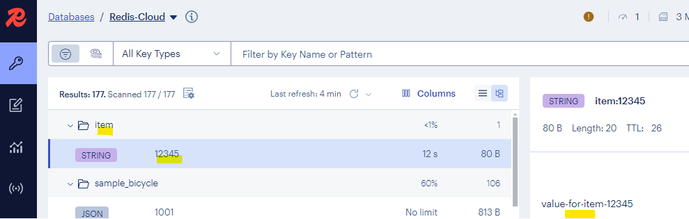
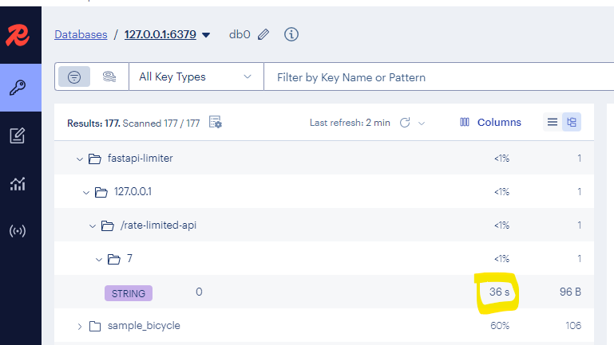

- https://fastapi.tiangolo.com/tutorial/
- Content-Disposition: inline/attachment
- `aiohttp`, `request` are commonly used as an asynchronous HTTP client

## 1. Django vs flask vs fastapi

| Feature            | **Django**                                  | **FastAPI**                                    |
| ------------------ | ------------------------------------------- | ---------------------------------------------- |
| **Type**           | Full-stack web framework                    | Lightweight API framework                      |
| **Speed**          | Moderate                                    | Very fast (async, Starlette-based)             |
| **Use Case**       | Web apps with templating, ORM, admin, auth  | APIs, microservices, async services            |
| **Learning Curve** | Easy for beginners, batteries-included      | Easy for experienced devs, requires some setup |
| **ORM**            | Built-in (Django ORM)                       | Optional (can use SQLAlchemy, Tortoise, etc.)  |
| **Admin Panel**    | Yes, built-in                               | No, must be custom-built                       |
| **Async Support**  | Limited (since Django 3.1+, still maturing) | Native and strong                              |
| **Community**      | Large, mature                               | Growing fast                                   |
| **Best For**       | Traditional web apps, CMS, admin-heavy apps | High-performance APIs, modern backend services |

## 2. sync API 
- **uvicorn src.webModule.controller.web2:app --reload**
- refers to an asynchronous, non-blocking API
- one that can handle multiple requests **concurrently** 
- without waiting for each request to complete before starting the next.
- eg: FastAPI is built on async I/O, powered by `Python’s async/await` ⬅️

```python
@app.get("/async")
async def read_data():
    await asyncio.sleep(2)  # Non-blocking
    return {"msg": "Done"}
```
- FastAPI can continue serving other requests while waiting for other to finish
- Also, frontend itself is written to handle asynchronous calls properly, with promise, observable 😁

## 3. POC
### 3.1. objective/s
- security: `fastapi.security`, `PyJWT`
    - with OAuth + jwt 
    - API Key authentication
- API - documentation,
- API version 
- handling different type on http request with header, body , path param, request param
- API cache static cache at app level : **redis and in-memory**
- Custom response codes & headers
- microservice communication
- tracing, logging, custom metric with otel to datadog
- handle rate  limiting and fault tolerance.
- Data validation  1
- middleware
    - logging, correlation ID, error handling, OpenTelemetry tracing
    - Dependency injection (`Depends`)
    - Testing with `pytest` + `TestClient`
- database / orm:
    - performing crud operation with database
    - connect to  postgresSQL
    - managing transaction and rollback
    - ORM with SQLAchemy, tortoise
    - data validation  2

| Requirement                             | FastAPI Support                                                                      |
|-----------------------------------------|--------------------------------------------------------------------------------------|
| Send request body, path, query, headers | ✅ Native support with clean syntax                                                   |
| Custom HTTP responses                   | ✅ Full control over status codes, headers, body                                      |
| Swagger docs                            | ✅ Auto-generated (OpenAPI + ReDoc)                                                   |
| Rate limiting / throttling              | ✅ Add via middleware (e.g. `slowapi`, `limits`)                                      |
| Caching API responses                   | ✅ Use tools like `FastAPI-Cache2`, `Redis`                                           |
| OAuth token-based security + JWT        | ✅ Built-in support via `fastapi.security`  `fastapi.security.OAuth2PasswordBearer`   |
| File download with progress             | ✅ Stream response with chunked transfer encoding `StreamingResponse` from Starlette  |
| Data validation                         | ✅ `Pydantic`                                                                         |

### 3.2. POC Steps
- 👉🏻 program::[web2.py](../../src/webModule/controller/web2.py)
```
Step 1: Host Simple API
🔸 Create root endpoint / returning a welcome message.

Step 2: Custom JSON Response
🔸 Send custom HTTP response with status code, headers, and body.

Step 3: Path, Query, Header, and Body Parameters
🔸 Accept and validate various types of request inputs.

Step 4: Swagger and ReDoc Auto Docs
🔸 Expose OpenAPI docs and explore endpoints.

Step 5: Secure Endpoints with OAuth2 + JWT
🔸 Protect routes with token-based authentication.

Step 6: Rate Limiting with SlowAPI
🔸 Throttle API calls using IP or user identity.

Step 7: Caching with fastapi-cache2
🔸 Cache responses and reduce server load.

Step 8: File Upload and Download (with progress)
🔸 Upload and stream-download files with chunking.

Step 9: Background Tasks
🔸 Offload long-running tasks to background.

Step 10: Dependency Injection + Middleware
🔸 Clean architecture using Depends, logging, etc.

Step 11: Connect to PostgreSQL (CRUD)
🔸 Use SQLAlchemy to handle DB operations.

Step 12: Dockerize the App
🔸 Add Dockerfile and docker-compose for deployment.

```
```
✅ DONE
Host API ✅
Custom JSON Response ✅
Handle Path/Query/Header/Body params ✅
Swagger docs ✅
Rate limiting with Redis ✅
OAuth2 token flow (client credentials) ✅
Cache API response in Redis ✅

File download API with progress tracking
Error handling & custom exception classes
Logging (e.g., request logs, error logs)
Unit tests (Pytest + FastAPI’s TestClient)
API versioning
Dockerize the project
Deploy to AWS (ECS/EKS, API Gateway, Lambda)
```

### 3.3. caching :: redis
- key => (e.g., appname:env:item:{item_id}



### 3.4. Rate limiting (app level)
- pip install `fastapi-limiter`  `redis`  `redis[asyncio]`
- FastAPILimiter.init(redis_client)

```
Code : 429
Error: Too Many Requests
Response body
Download
{
  "detail": "Too Many Requests"
}
```



