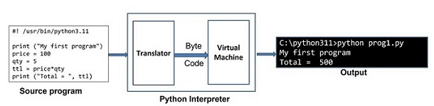
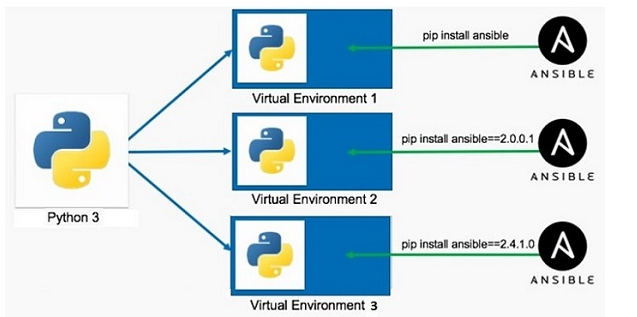

# python 3.x (since 2008)
## Reference
- https://chatgpt.com/c/68536dbf-dd20-800d-9328-f38fcbdef71e | fundamentals-1
- https://chatgpt.com/c/6856fc5b-1158-800d-8222-c209716ac1e3 | fundamentals-2
- https://chatgpt.com/c/6854510f-b2d4-800d-afd2-c1a3dba598ec | Question list 1
- https://chatgpt.com/c/685647fe-4340-800d-bfe6-adb6a3f60d42 | m1:collections,etc
- https://chatgpt.com/c/68535fab-0494-800d-af09-a35817d88f6a | m2:file,json,os,pathlib,etc
- https://chatgpt.com/c/6860073b-f944-800d-840d-293a4e339ddc | py more lib :: explanation
- https://chatgpt.com/c/68535fab-0494-800d-af09-a35817d88f6a | web1
- https://chatgpt.com/c/68591a85-d678-800d-9f7f-ec93a102eb9a | web2 (microservices)

---
## 1 py::Intro
- **high-level**
- open-source and cross-platform programming language
- Rapid Prototyping with REPL : Python shell + Jupyter
- Strong Community and Documentation
- **interpreted** 
    - processed at runtime by the interpreter.
    - do not need to compile your program
- **OOPS, functional, procedural**
- extensive lib (built-in / 3rd party)

---
## 2 py::usage
- Web development
- Data Science 
- machine learning
- Job scheduling, Automation and scripting
- ETl (pySpark)
- **more**
    - Desktop GUI Applications
    - Console-based Applications
    - Game Development

---
## 3 py::install and run
-  https://www.python.org/
- update env var:  PATH, PYTHONPATH, PYTHONHOME
```shell
sudo apt-get install python3.11
sudo yum install python3
```
- linux: Python's executable is installed in **/usr/bin/** directory
- windows:   **C:\python311**
- REPL : py enter, then >>> prompt will come. quit()
- run : **python3 prog-1.py**
- **Shebang** 
    - #! /usr/bin/python3.11
    - script itself can be a self executable in Linux, like a shell script
    - run directly: ./prog-1.py
  
- 

---
## 4 py::venv
- system-wide installation done above.
- need isolated environments of Python, for diff appl.
- **python3 -m venv myvenv**
- myvenv\scripts\**activate**
- 

## 5. py::reserved keyword
```
and	as	assert
break	class	continue
def	del	elif
else	except	False
finally	for	from
global	if	import
in	is	lambda
None	nonlocal	not
or	pass	raise
return	True	try
while	with	yield
```

---
- python -m timeit -s "lst = list(range(1000))" "sum(lst)"
- python -m cProfile your_script.py
