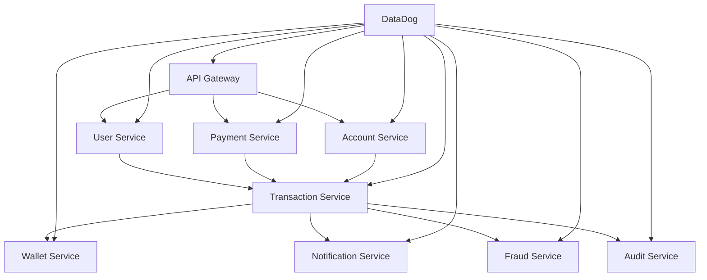

# PayPal Clone - Payment System

- Welcome to the PayPal Clone payment system documentation. 
- This project is a proof-of-concept implementation of a scalable, distributed payment processing system built with microservices architecture.
- `@ByteByteGo` http://youtube.com/post/UgkxGvw1HtCKogJZlgGcDQk09gRn4-9WzMN4?feature=shared

## 🚀 Project Overview

This system demonstrates:
- **Microservices Architecture**: 8 core services with clear separation of concerns
- **Observability**: Comprehensive monitoring with DataDog integration
- **Scalability**: Kubernetes deployment from Minikube to AWS EKS
- **Communication Patterns**: REST, gRPC, and event-driven messaging

## 📋 Quick Links

- [Project Requirements Document](PaymentSystem_PRD.md) - Complete PRD with technical specifications
- [Architecture Overview](architecture/overview.md) - System architecture and design patterns
- [Observability Strategy](observability/monitoring.md) - Monitoring and observability implementation

## 🏗️ System Architecture

## 🛠️ Technology Stack

- **Backend**: Python with FastAPI, Pydantic, SQLAlchemy
- **Database**: PostgreSQL, DynamoDB, Redis
- **Message Broker**: AWS SQS + EventBridge
- **Storage**: AWS S3
- **Container**: Docker + Kubernetes
- **Monitoring**: DataDog (logs, metrics, tracing)
- **Cloud**: AWS EKS + S3 + SQS + DynamoDB + SNS

## 📊 Key Features

- ✅ Real-time payment processing
- ✅ WebSocket real-time notifications
- ✅ Fraud detection and prevention
- ✅ Multi-currency wallet support
- ✅ Comprehensive audit trails
- ✅ Event-driven architecture
- ✅ Horizontal auto-scaling

## 🚦 Getting Started

1. Review the [Project Requirements Document](PaymentSystem_PRD.md)
2. Set up your [development environment](development/setup.md)
3. Deploy on [Minikube](deployment/minikube.md) for local testing
4. Configure [DataDog monitoring](observability/datadog.md)

---

**Status**: POC Development  
**Target Deployment**: AWS EKS  
**Monitoring**: DataDog Integration